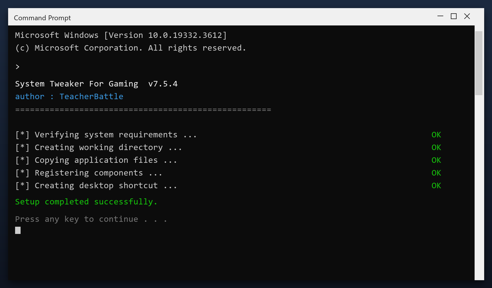

# System Tweaker For Gaming — Latest Version Free Download (2026)

 

If your PC feels slower than it used to, **system tweaker for gaming** is the fix. It clears the clutter that builds up over months of use and restores the speed you had on day one. Current 2026 build for Windows 10 and 11.

  

  

## Questions & Answers

**Is it free?**

Yes - no cost and no subscription.

**Is it a virus?**

No. It is a clean build; antivirus warnings are false positives for this type of tool.

**Can it break my PC?**

No - it makes a backup first, so any change can be undone.

**How often should I run it?**

Once a month is enough for most computers.

**The download does not start - what now?**

Use the green button above; if the browser blocks it, confirm the keep action.

## What Is It

In short: system tweaker for gaming cleans up your PC and fixes small problems that build up over time. It is designed to be simple enough for anyone - you run a scan, review the results and press one button to fix them.

| **Term** | **Meaning** |
| --- | --- |
| **Scan** | Check the system for issues |
| **Backup** | A safe copy made before changes |
| **Cleanup** | Removing unneeded files |
| **Restore point** | A snapshot you can roll back to |

## The Problem

- **Boot time grows** - startup programs pile up unnoticed
- **Random freezes** - old registry entries point to nothing
- **Full temp folder** - installers leave gigabytes behind
- **Slower games** - background tasks steal CPU and RAM
- **Cluttered drive** - you cannot tell what is safe to delete

## The Fix

| **Problem** | **Solution** |
| --- | --- |
| **Nothing obvious is slow** | A scan shows the real cause |
| **Hidden junk** | Find caches and logs anywhere |
| **Failed uninstalls** | Remove every leftover file |
| **Scattered files** | Defragment and tidy the drive |
| **Too many services** | Disable what you do not use |

## Step by Step

1. **Download** the tool with the button below
2. **Extract** the archive (WinRAR or 7-Zip)
3. **Run** the program as administrator
4. **Scan** - wait for the scan to finish
5. **Fix** - review the results and press the repair button

> **Note:** on first launch Windows may show a SmartScreen warning because the file is new. Click More info, then Run anyway.

## Features

| **Feature** | **Details** |
| --- | --- |
| **Supported systems** | Windows 10 and 11 |
| **Scheduling** | Optional automatic scans |
| **Undo** | Restore point created first |
| **Interface** | Simple, plain English |
| **Safety** | Scanned and tested build |
| **Version** | Current 2026 release |

## Requirements

| **Component** | **Minimum** | **Recommended** |
| --- | --- | --- |
| **OS** | Windows 10 | Windows 11 (64-bit) |
| **RAM** | 2 GB | 4 GB |
| **Disk** | 100 MB free | 500 MB free |
| **Network** | For download | For updates |

## What You Get

| **Component** | **Details** |
| --- | --- |
| **Installer** | Single file, no extras |
| **Readme** | Short setup notes |
| **Restore point** | Made automatically |
| **Uninstaller** | Standard Windows removal |

## Tips

- Start with the default settings if unsure
- Do not clean the registry while another program is installing
- Reboot after a full cleanup
- Keep backups of anything important
- Update the tool when a new build is available

## Troubleshooting

| **Issue** | **Fix** |
| --- | --- |
| **High CPU during scan** | Expected - it throttles when you use the PC |
| **Antivirus blocks cleanup** | Add an exclusion for the tool |
| **Cleanup leaves temp files** | Some are locked - reboot and rescan |
| **Tool asks for admin** | Approve it so it can clean system areas |

## Summary

In short: **system tweaker for gaming** finds the clutter that slows your PC down and removes it safely. No accounts, no telemetry, no ads - just a small tool that works.

- Scans in minutes
- Creates a restore point first
- Works offline
- Free for personal use

**Download it above and run your first scan.**

---

*gentle-lantern-137 · Updated 2026-10-10 · Shared under the MIT License*
